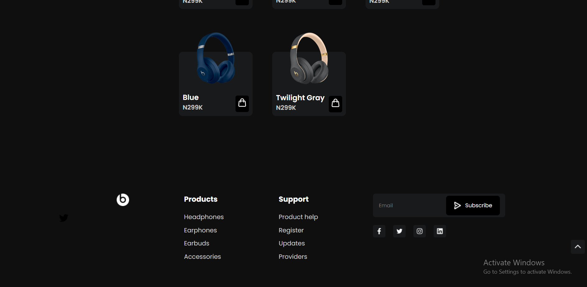

<!-- Intro -->
# All About Live-Class-Project-8

<!-- Social Links -->
[![LinkedIn][linkedin-shield]][linkedin-url]
[![Hashnode][hashnode-shield]][hashnode-url]

<!-- PROJECT LOGO -->

<!-- ABOUT THE PROJECT -->

## About The Project
 

 

Here is a Screen-Shot of my project-8 and I used in this project is Flexbox. For readme files I used markdown technology.
 
 

## Live Project

This project is presently deployed in Netlify Service.

[Live Project URL](https://uu02344-beats.netlify.app/)
 

[linkedin-shield]: https://img.shields.io/badge/-LinkedIn-black.svg?style=for-the-badge&logo=linkedin&colorB=0B5FBB
[linkedin-url]: https://www.linkedin.com/in/usama-usman-7331a3248/

<!-- Hashnode -->

[hashnode-shield]: https://img.shields.io/badge/Hashnode-2962FF?style=for-the-badge&logo=hashnode&logoColor=white
[hashnode-url]: https://usama400.hashnode.dev/
